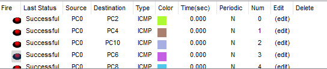

# 📡 FLSM Subnetting with DHCP and Static Routing 

This project demonstrates **Fixed Length Subnet Masking (FLSM)** to divide the `192.168.1.0/24` network into **eight equal subnets**, each supporting up to **30 hosts**. The setup includes **3 routers** connected via serial interfaces and serving multiple LANs with DHCP configured.

---

## 🧠 Objectives

- Subnet a /24 network using FLSM for 30 hosts per subnet.
- Configure IP addressing on routers for each subnet.
- Assign serial IPs and configure static routing.
- Enable DHCP for each subnet.
- Verify connectivity across all routers and LANs.

---

## 🖼️ Topology 

---

## 🧮 Subnet Breakdown

| Subnet | Network Address | First IP | Last IP | Broadcast |
|--------|------------------|----------|---------|-----------|
| 1      | 192.168.1.0       | .1       | .30     | .31        |
| 2      | 192.168.1.32      | .33      | .62     | .63        |
| 3      | 192.168.1.64      | .65      | .94     | .95        |
| 4      | 192.168.1.96      | .97      | .126    | .127       |
| 5      | 192.168.1.128     | .129     | .158    | .159       |
| 6      | 192.168.1.160     | .161     | .190    | .191       |
| 7      | 192.168.1.192     | .193     | .222    | .223       |
| 8      | 192.168.1.224     | .225     | .254    | .255       |

---

## 🛠️ Router Configuration Summary

### 🔌 Router 0

<pre>Router(config)#interface fastEthernet 0/0
Router(config-if)#ip address 192.168.1.1 255.255.255.224
Router(config-if)#no shutdown 

Router(config)#interface fastEthernet 0/1
Router(config-if)#ip address 192.168.1.33 255.255.255.224
Router(config-if)#no shutdown 

Router(config)#interface serial 0/0
Router(config-if)#ip address 192.168.1.193 255.255.255.224
Router(config-if)#no shutdown

Router(config)#ip route 192.168.1.64 255.255.255.224 192.168.1.222
Router(config)#ip route 192.168.1.96 255.255.255.224 192.168.1.222
Router(config)#ip route 192.168.1.128 255.255.255.224 192.168.1.222
Router(config)#ip route 192.168.1.160 255.255.255.224 192.168.1.222

Router(config)#ip dhcp pool network1
Router(dhcp-config)#network 192.168.1.0 255.255.255.224
Router(dhcp-config)#default-router 192.168.1.1

Router(config)#ip dhcp pool network2
Router(dhcp-config)#network 192.168.1.32 255.255.255.224
Router(dhcp-config)#default-router 192.168.1.33</pre>

---

### 🔌 Router 1

<pre>Router(config)#interface fastEthernet 0/0
Router(config-if)#ip address 192.168.1.65 255.255.255.224
Router(config-if)#no shutdown

Router(config)#interface fastEthernet 0/1
Router(config-if)#ip address 192.168.1.97 255.255.255.224
Router(config-if)#no shutdown 

Router(config)#interface serial 0/0
Router(config-if)#ip address 192.168.1.222 255.255.255.224
Router(config-if)#no shutdown 

Router(config)#interface serial 0/1
Router(config-if)#ip address 192.168.1.225 255.255.255.224
Router(config-if)#no shutdown 

Router(config)#ip route 192.168.1.0 255.255.255.224 192.168.1.193
Router(config)#ip route 192.168.1.32 255.255.255.224 192.168.1.193
Router(config)#ip route 192.168.1.128 255.255.255.224 192.168.1.254
Router(config)#ip route 192.168.1.160 255.255.255.224 192.168.1.254

Router(config)#ip dhcp  pool network1
Router(dhcp-config)#network 192.168.1.64 255.255.255.224 
Router(dhcp-config)#default-router 192.168.1.65

Router(config)#ip dhcp pool network2
Router(dhcp-config)#network 192.168.1.96 255.255.255.224
Router(dhcp-config)#default-router 192.168.1.97</pre>

---

### 🔌 Router 2

<pre>Router(config)#interface fastEthernet 0/0
Router(config-if)#ip address 192.168.1.129 255.255.255.224
Router(config-if)#no shutdown

Router(config)#interface fastEthernet 0/1
Router(config-if)#ip address 192.168.1.161 255.255.255.224
Router(config-if)#no shutdown 

Router(config)#interface serial 0/0
Router(config-if)#ip address 192.168.1.254 255.255.255.224
Router(config-if)#no shutdown 

Router(config)#ip route 192.168.1.64 255.255.255.224 192.168.1.225
Router(config)#ip route 192.168.1.96 255.255.255.224 192.168.1.225
Router(config)#ip route 192.168.1.0 255.255.255.224 192.168.1.225
Router(config)#ip route 192.168.1.32 255.255.255.224 192.168.1.225

Router(config)#ip dhcp pool network1
Router(dhcp-config)#network 192.168.1.128 255.255.255.224
Router(dhcp-config)#default-router 192.168.1.129

Router(config)#ip dhcp pool network2
Router(dhcp-config)#network 192.168.1.160 255.255.255.224
Router(dhcp-config)#default-router 192.168.1.161</pre>

---

### ✅ Output 

---

### 📂 Folder Structure

FLSM-Subnetting/

    ├── 01-Topology.png
    ├── 02-Output.png
    └── README.md
