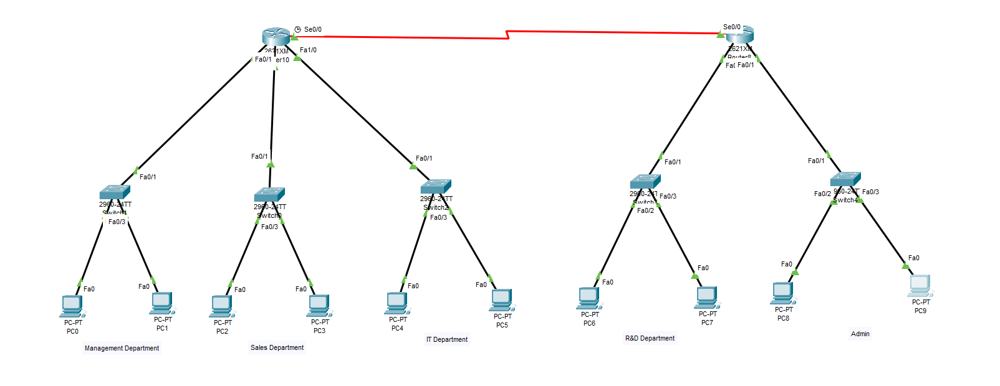
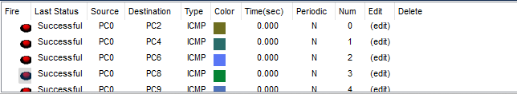

# 📡 VLSM Subnetting with DHCP and Static Routing 

This practical demonstrates the use of **Variable Length Subnet Masking (VLSM)**, **DHCP pools**, and **static routing** in a multi-department network topology using two routers in Cisco Packet Tracer.

---

## 🎯 Objectives

- Implement VLSM to allocate IP ranges based on department host needs.
- Configure each router with appropriate subnetting.
- Set up **DHCP pools** for automatic IP allocation per department.
- Establish **static routing** between two routers using a point-to-point serial link.

---

## 🖼️ Topology 

---

## 🧮 Subnetting Breakdown (VLSM)

| Department      | Hosts | Subnet              | Subnet Mask         | Range                     | Broadcast         |
|-----------------|--------|---------------------|----------------------|---------------------------|-------------------|
| Management      | 60     | 192.168.10.0/26     | 255.255.255.192      | 192.168.10.1 – 62         | 192.168.10.63      |
| Sales           | 30     | 192.168.10.64/27    | 255.255.255.224      | 192.168.10.65 – 94        | 192.168.10.95      |
| IT              | 12     | 192.168.10.96/28    | 255.255.255.240      | 192.168.10.97 – 110       |192.168.10.111     |
| R&D             | 6      | 192.168.10.112/29   | 255.255.255.248      | 192.168.10.113 – 118      |192.168.10.119     |
| Admin           | 4      | 192.168.10.120/29   | 255.255.255.248      | 192.168.10.121 – 126      |192.168.10.127     |
| Serial Link     | 2      | 10.0.0.0/30         | 255.255.255.252      | 10.0.0.1 – 10.0.0.2        | 10.0.0.3           |

---

## 🔧 Router 1 Configuration

<pre>Router(config)#interface fastEthernet 0/0
Router(config-if)#ip add 192.168.10.1 255.255.255.192
Router(config-if)#no shutdown 

Router(config)#interface fastEthernet 0/1
Router(config-if)#ip address 192.168.10.65 255.255.255.224
Router(config-if)#no shutdown 

Router(config)#interface fastEthernet 1/0
Router(config-if)#ip address 192.168.10.97 255.255.255.240
Router(config-if)#no shutdown 

Router(config)#interface serial 0/0
Router(config-if)#ip address 10.0.0.1 255.255.255.252
Router(config-if)#no shutdown 

Router(config)#ip dhcp pool management
Router(dhcp-config)#network 192.168.10.0 255.255.255.192
Router(dhcp-config)#default-router 192.168.10.1			

Router(config)#ip dhcp pool sales
Router(dhcp-config)#network 192.168.10.64 255.255.255.224
Router(dhcp-config)#default-router 192.168.10.65

Router(config)#ip dhcp pool IT
Router(dhcp-config)#network 192.168.10.96 255.255.255.240
Router(dhcp-config)#default-router 192.168.10.97

Router(config)#ip route 192.168.10.112 255.255.255.248 10.0.0.2
Router(config)#ip route 192.168.10.120 255.255.255.252 10.0.0.2</pre>

---

### 🔧 Router 2 Configuration

<pre>Router(config)#interface fastEthernet 0/0
Router(config-if)#ip address 192.168.10.113 255.255.255.248
Router(config-if)#no shutdown

Router(config)#interface fastEthernet 0/1
Router(config-if)#ip address 192.168.10.121 255.255.255.248
Router(config-if)#no shutdown 

Router(config)#interface serial 0/0
Router(config-if)#ip address 10.0.0.2 255.255.255.252
Router(config-if)#no shutdown

Router(config)#ip dhcp pool R&D
Router(dhcp-config)#network 192.168.10.112 255.255.255.248
Router(dhcp-config)#default-router 192.168.10.113

Router(config)#ip dhcp pool Admin
Router(dhcp-config)#network 192.168.10.120 255.255.255.252
Router(dhcp-config)#default-router 192.168.10.121

Router(config)#ip route 192.168.10.0 255.255.255.192 10.0.0.1
Router(config)#ip route 192.168.10.64 255.255.255.224 10.0.0.1
Router(config)#ip route 192.168.10.96 255.255.255.240 10.0.0.1</pre>

---

### ✅ Output Verification

- ✅ PCs received IPs via DHCP
- ✅ All departments can communicate

---

### 📂 Folder Structure

VLSM-Subnetting/

    ├── 01-Topology.png
    ├── 02-Output.png
    └── README.md
